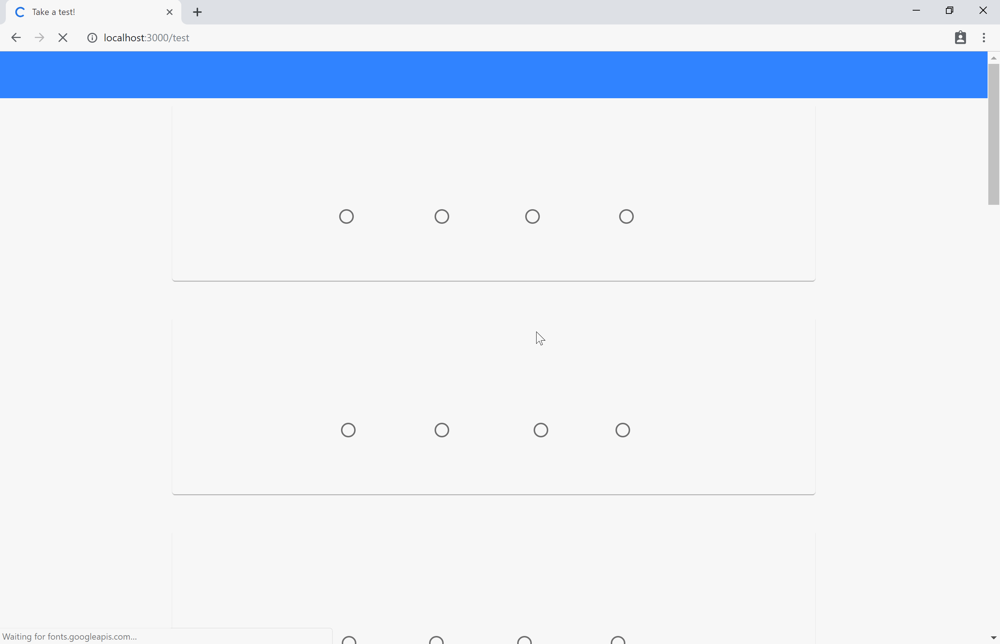

# Chinese Pronunciation

This is a homework to build a site to learn PinYin and realize some functions.

So far it's been under production.

## Introduction

### Pages

#### Main Layout

The main layout contains a tabBar, sideBar and footer.

The top bar will hide and display automatically.

{ width=50% }

##### Side bar:

It can be unfolded.

{ width=50% }

##### Search bar

*under production*

{ width=50% }

#### learn page

Using app top bar to divide it into four parts. It contains a widget to search pronunciation on the fourth page.

{ width=50% }

#### Test page

##### Ratios

The result of one question will be displayed as soon as ratio is clicked.

Ratio's color changes depending on whether the answer is true. Pronunciations of the question and selected answer will be played automatically. After clicking, all four ratios are disabled.

*User can submit with questions unfinished, this is a feature.*

{ width=50% }

##### Dynamic problems

All problems are displayed randomly. Refreshing the page to show a new set of questions.

{ width=50% }

### Functions

#### Pronunciation search

Input a **single** Chinese letter or pinyin of **one** hanzi, the pronunciaton can be showed on the right. Clicking the icon to play the pronunciation.

{ width=50% }

#### Charts

Viewing animated result chart in three types.  

{ width=50% }

#### User History

Log in to save the test history and logging in history.

{ width=50% }

## Documentation

### Dependencies

- node.js

- jQuery

below is a **main** list of node.js plugins, for details please refer to package.json

- [material-components-web](https://github.com/material-components/material-components-web)

- express

- webpack

- chart.js

- express-session

- [pinyin](https://github.com/hotoo/pinyin)

### Usage

To setup in development, refer [here](documentation.md).

run server ( **only** run this for display )

```
npm run display
```

### For full documentation, please refer [here](documentation.md)

## TODO

- [ ] user login

      - [x] database
      - [ ] frontend interaction

- [ ] user history

      - [x] chart
      - [x] database
      - [ ] store& check

- [ ] setting page

- [ ] search 

      - [x] entrance
      - [ ] backend
      - [ ] webpage

{ width=50% }

{ width=50% }
